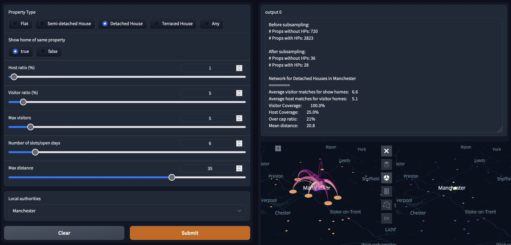
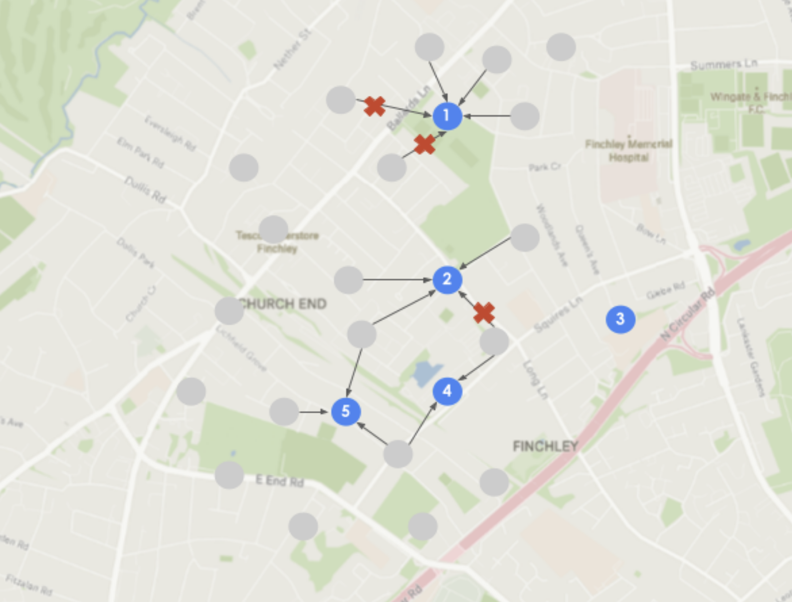
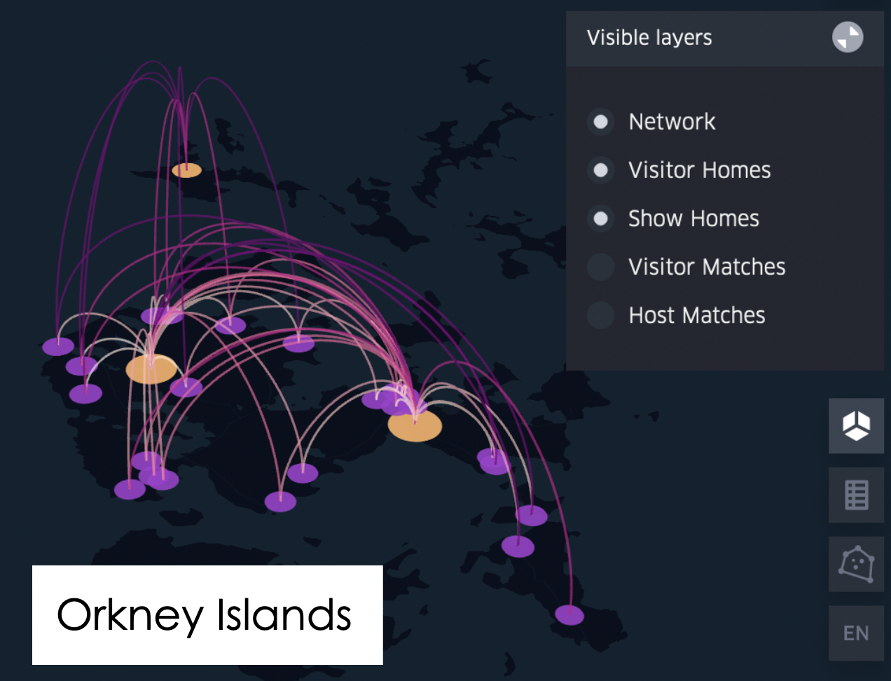
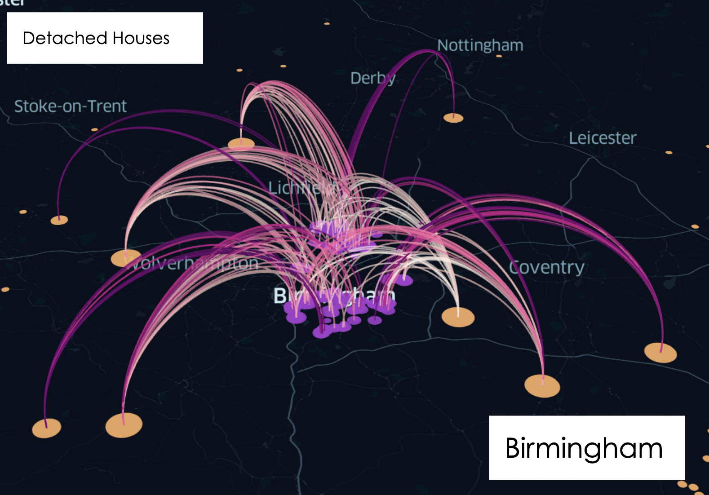
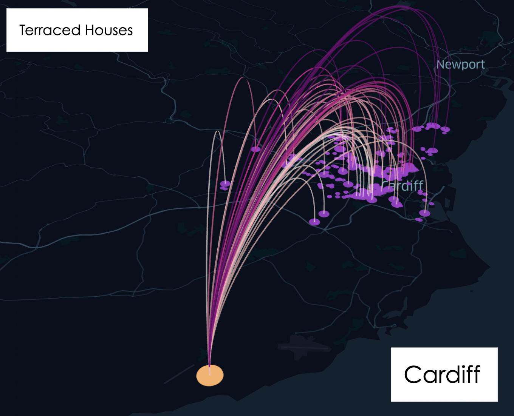
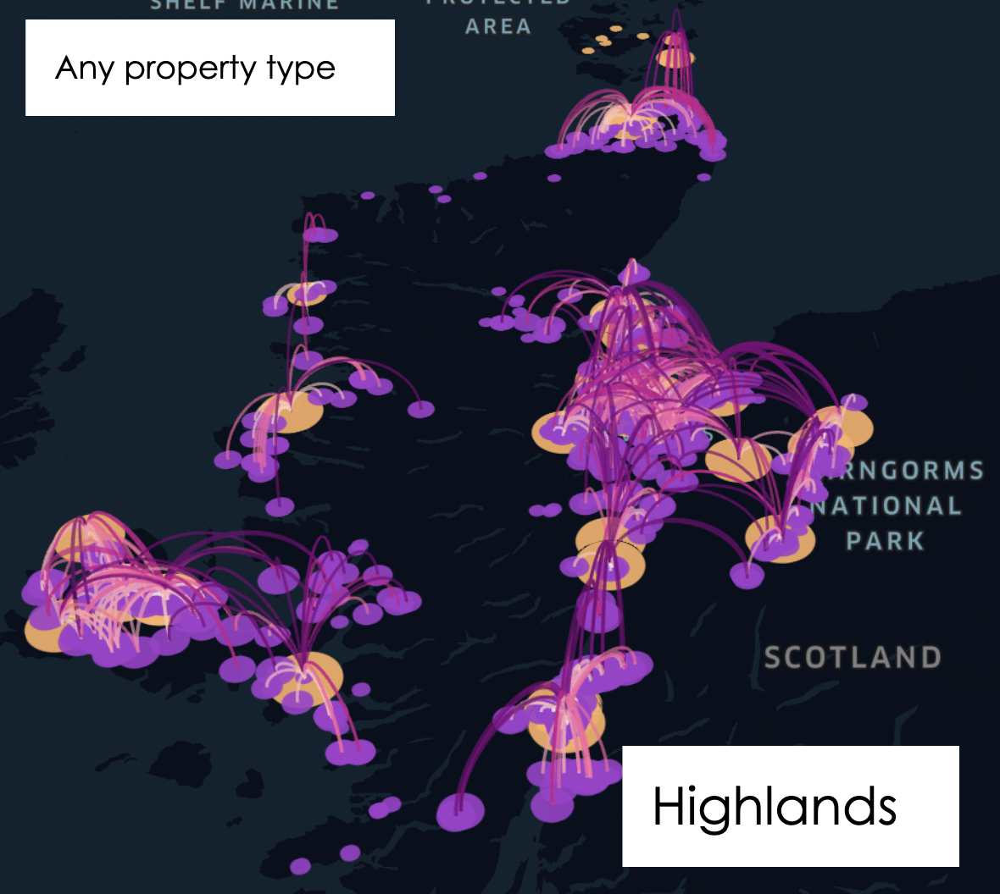
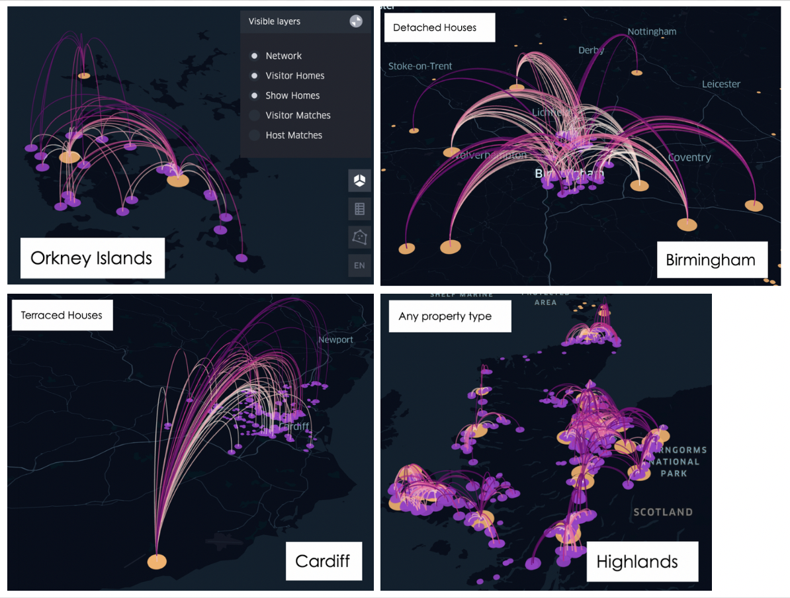

# Heat pump show homes


<br>

While heat pumps are becoming more and more popular, only few people in the UK have actually seen one in action. Having the opportunity to visit a running heat pump in a real home - not a show room - could help many potential adopters to get a better understanding for heat pumps and what it is like to have one at home.

The Sustainable Future team at Nesta tested the idea of show homes for heat pumps with two show homes in London and Glasgow with promising results. Both visitors and hosts were extremely happy with the experience.

Find out more about the project and sign up for the next round of show home events on <a href="visitaheatpump.com/" title="VisitAHeatPump">visitaheatpump.com</a>.

This data work supports the 'real-life' trials by analysing the capacity and reach of potential networks of show homes in different areas. Our initial data work showed that on average a person is no further than a 15min drive away from the nearest heat pump, which inspired confidence in our project. You can play around with the <a href="https://nestauk.github.io/show_homes/Distances_similar" title="Distance to nearest show home">interactive map</a> that shows the distance to the closest property with a heat pump for a randomly selected sample of visitor and host homes.

In further research, we built a data tool matches visitor home to show homes (still using model data) while considering maximum diving distance and capacity of the show homes. The mock example below shows how certain visitor homes (gray) cannot be matched with a suitable host home (blue), either because the host home is too far away or because it's already booked out - in this example, each show home can only host three visitors.



The data tool lets you explore different scenarios and compute the impact and reach of a network. For example, you can set the number of visitors per slot, adjust the maximum driving distance or play around with different numbers of hosts and visitors.

We found different patterns for different areas and prooperty types when modelling a potential network, suggesting that show home networks might work better in some areas or may require the addition of strategically placed show homes in remote areas or show rooms (e.g. in DIY stores) in regions with high demand.

<!-- <p float="left">


</p>

<p float="left">


</p> -->



Future research may include an agent-based model that investigates and models how a network would develop over time in different areas.

---

## Setup

- Meet the data science cookiecutter [requirements](http://nestauk.github.io/ds-cookiecutter/quickstart), in brief:
  - Install: `git-crypt`, `direnv`, and `conda`
  - Have a Nesta AWS account configured with `awscli`

```
git clone https://github.com/nestauk/show_homes.git
cd show_homes
git checkout 4_show_home_network
make install
```

`make install` may take a while and finally throw an error for AWS+Metaflow like below, but that's fine.

```
May throw error at megaflop Configuring Metaflow + AWSAWS + Metaflow setup failed, check .cookiecutter/state/setup-metaflow for more info
make: *** [.cookiecutter/state/setup-metaflow] Error 1
```

Next, activate the environment and download the necessary files:

```
conda activate show_homes
aws s3 sync s3://asf-show-homes/inputs ./inputs
aws s3 sync s3://asf-show-homes/outputs/data ./outputs/data
```

If this throws an error like `ModuleNotFoundError: No module named 'bcdoc.mangen'`, try:

```
pip install --upgrade awscli
```

Otherwise, you can manually download the necessary files from the S3 bucket named [asf-show-homes](https://s3.console.aws.amazon.com/s3/buckets/asf-show-homes?region=eu-west-2&tab=objects). If not interested in analysing the speed testing results in detail, downloading the following two files will be sufficient:

- `inputs/kepler_configs/network_gradio_config.txt`
- `inputs/data/epc_for_show_homes.csv`

## Contributor guidelines

[Technical and working style guidelines](https://github.com/nestauk/ds-cookiecutter/blob/master/GUIDELINES.md)

---

<small><p>Project based on <a target="_blank" href="https://github.com/nestauk/ds-cookiecutter">Nesta's data science project template</a>
(<a href="http://nestauk.github.io/ds-cookiecutter">Read the docs here</a>).
</small>
