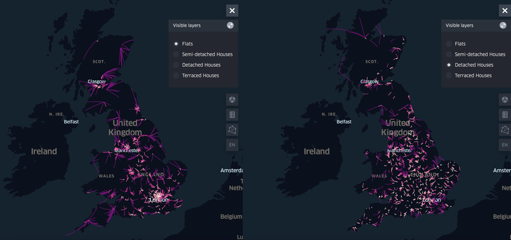

# Heat Pump Show Homes

Our Sustainable Future team at Nesta speed-tested the idea of show homes for heat pumps. You can read the full report <a href="https://www.nesta.org.uk/a-network-of-show-homes-for-heat-pumps/" title="Wales EPC IMD">here</a>.

We assumed that the owners of 0.5% of all heat pump properties would volunteer to open their homes to visitors. In order to get a sense of the distances potential visitors would have to travel, we computed the **average driving distance** to the nearest heat pump show home, given a randomly selected subset of heat pump homes and visitor homes.

Given 1,000 randomly sampled properties with a heat pump and 10,000 without across GB, the closest heat pump can on average be reached within a 10-minute car drive. However, when we look to identify properties of a similar type, the driving time doubles for flats and detached houses. The driving time is even greater for semi-detached and terraced houses, tripling to around 30 minutes.

This <a href="Distances_similar" title="Distance to nearest show home">interactive map</a> allows you to explore the distances for the different property types and gives a sense of their heat pump distributions. The brighter the colour, the shorter the driving distance to the nearest heat pump show home of the same type. Using the top right menu bar, you can switch between different property types: flats, detached houses, semi-detached houses and terraced houses.

Note that this is mock data and does not represent actual show homes for heat pumps or potential visitors' homes.

